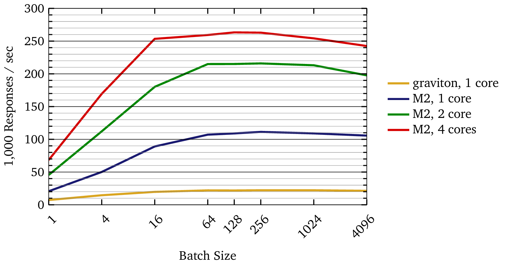

# roughtime-protocol

`roughtime-protocol` is a Clojure implementation of the **Roughtime protocol core**, as specified in both:

- the original Google specification
  https://roughtime.googlesource.com/roughtime/+/HEAD/PROTOCOL.md
- the IETF draft specification (up through draft-15)
  https://datatracker.ietf.org/doc/html/draft-ietf-ntp-roughtime-15

This repository is **not** a complete client or server.
Instead, it provides the **core cryptographic and parsing logic** needed to build interoperable Roughtime clients and servers.
See:
* [roughtime-client](https://github.com/Sturdy-Statistics/roughtime-client) for a simple CLI client based on this codebase, or
* [roughtime-server](https://github.com/Sturdy-Statistics/roughtime-server) for a full server based on this codebase.

The library aims to support *all* non-expired protocol versions, spanning both the Google (version 0) and IETF eras (currently versions 1–15).

[](https://clojars.org/com.sturdystats/roughtime-protocol)

```clojure
{:deps {com.sturdystats/roughtime-protocol {:mvn/version "VERSION"}}}
```

## Protocol support

All versions are supported **except** the expired IETF drafts **5** and **7**.

The implementation has been tested against external test vectors for the following versions:

- **Version 0 (Google)** — Cloudflare test vectors
- **Version 8** — Cloudflare test vectors
- **Version 11** — Cloudflare test vectors
- **Version 14** — int08h test vectors

Tests for versions **0**, **8**, and **11** include **batched (Merkle tree) responses**.

The implementation has also been tested against live traffic for the following versions:

- **Version 0 (Google)** — Cloudflare, int08h, and TXRyan
- **Version 8** — Cloudflare
- **Version 11** — Cloudflare
- **Version 14** — roughtime.se and int08h

> Note: versions 1 and 2 of the IETF proposal put the NONC tag inside the SREP tag, which is signed.
> This choice precludes batching responses, which is a key component of Roughtime and enables Roughtime to handle high traffic (see the Performance section below).
> Thus, this library will respond to versions 1 and 2 serially, but will simply drop requests from these versions when responding in batches.

## Why?

Roughtime’s security model depends on **diversity**.
The “lie-detecting” nature of the protocol requires:

- multiple independent servers
- multiple independent implementations
- the ability to chain responses across versions and operators

From the protocol document:

> To carry out a Roughtime measurement, a client SHOULD be equipped with a list of servers, a minimum of three of which are operational and not run by the same parties.

Today, the ecosystem is still quite small: there are only a handful of public servers.
Moreover, because different servers implement different protocol versions, chaining more than two requests is difficult in practice.
This weakens the protocol’s ability to demonstrate server misbehavior.

When the ecosystem is this small, **even one additional implementation materially improves robustness**.

By supporting *all active versions* of the protocol, this library can act as a **compatibility bridge**, making it easier to write clients that support cross-version request chaining.
We also hope to make it easy for anyone interested to deploy a server.

## Example Usage

The following example demonstrates a full end-to-end exchange:

- minting a delegation certificate (done by server)
- constructing a request (done by client)
- generating a response (done by server)
- parsing and validating the response (done by client)

The example iterates across all supported protocol versions.

```clj
(ns example
  (:require
   [roughtime-protocol.sign :as sign]
   [roughtime-protocol.util :as u]
   [roughtime-protocol.request :as rq]
   [roughtime-protocol.server :as server]
   [roughtime-protocol.client :as client]))

(def supported-versions [ ;; initial Google protocol
                         0x00

                         ;; IETF draft series
                         0x80000001 ;; ietf draft ver 1
                         0x80000002 ;; ietf draft ver 2
                         0x80000003 ;; ietf draft ver 3
                         0x80000004 ;; ietf draft ver 4
                         ;; 5 is expired
                         0x80000006 ;; ietf draft ver 6
                         ;; 7 is expired
                         0x80000008 ;; ietf draft ver 8
                         0x80000009 ;; ietf draft ver 9
                         0x8000000a ;; ietf draft ver 10
                         0x8000000b ;; ietf draft ver 11

                         0x8000000c ;; ietf draft vers 12-15 didn't increment

                         ;; v1 not released yet
                         ])

;;; demo script
(let [ ;; make a long-term keypair (done once, before initial server deploy)
      lt!!     (sign/gen-ed25519-kp)
      lt-pub   (.getPublic lt!!)
      lt-prv!! (.getPrivate lt!!)

      ;; raw bytes for the public key
      public-key (-> lt-pub sign/public-key->spki sign/spki->raw-pub32)

      ;; mint a new certificate (done by server on some cadence)
      ;; NB: this is a map: version ↦ CERT bytes
      cert-map   (server/mint-new-certificate-map lt-prv!!)]

  ;; loop over all versions
  (doseq [ver supported-versions]

    (let [;; build a request (done by client)
          req-bytes (rq/make-request
                     {:ver [ver]
                      :msg-size 1024
                      :public-key public-key})

          ;; respond to request (serial; done by server)
          rsp-bytes (server/respond {:request-bytes req-bytes
                                     :cert-map cert-map})

          ;; wrap request/response in an exchange (done by client)
          exchange  (client/response->exchange
                     {:request-bytes   req-bytes
                      :response-bytes  rsp-bytes
                      :server-map      {:public-key (u/bytes->b64 public-key)}})]

      ;; validate the exchange and extract time (done by client)
      ;; NB: validate-response throws on failure
      (try
        (when (client/validate-response exchange)
          (client/process-time exchange))
        (catch Throwable _
          (println (format "Failed for version 0x%08x" ver)))))))
```

## Performance

This library is designed for high compatibility, but attempts to maintain acceptable performance.

While the parsing and logic is written in a high-level language, when processing batches the overhead compared to the Google C++ implementation is modest.
In an informal test with ED25519 signatures stubbed to a no-op, this server respond to a single v0 request in 4.3 μs while the C++ code responded in 2.8 μs.

Speed depends strongly on CPU architecture, on batch size, and on the protocol version.
If performance is important to your application, we suggest you benchmark the code using your particular setup.

The following script measures the throughput, or how quickly the code can respond to requests, as a function of batch size.
It uses 4 cores by default; you can change this by modifying the `parallelism` parameter in the code.

```
clj -X:throughput
```

Example measurements responding to protocol version 15 on a 2023 M2 MacBook Air, and on an EC2 `t4g` Graviton2 instance:



(The Google protocol is approximately 2× faster.)
While this codebase is not intended for high-traffic production environments, it may be suitable for real-world use.

### Benchmarks (Per-Request Latency)

The following table compares the latency per request when processing 5,000 requests, either serially or in batches of 128.

| Codebase   | Batch Size | Version       | Signature | Per Request (μs) |
|------------|-----------:|---------------|-----------|-----------------:|
| Google C++ |          1 | Google        | tweetnacl |              675 |
| Google C++ |          1 | Google        | stubbed   |              1.8 |
|------------|-----------:|---------------|-----------|-----------------:|
| Clojure    |          1 | Google        | native    |             26.6 |
| Clojure    |          1 | Google        | stubbed   |              4.3 |
|------------|-----------:|---------------|-----------|-----------------:|
| Clojure    |          1 | IETF Draft 15 | native    |             31.7 |
| Clojure    |          1 | IETF Draft 15 | stubbed   |              9.2 |
|------------|-----------:|---------------|-----------|-----------------:|
| Clojure    |        128 | IETF Draft 15 | native    |              4.4 |
| Clojure    |        128 | IETF Draft 15 | stubbed   |              4.2 |
|------------|-----------:|---------------|-----------|-----------------:|
| Clojure    |       1024 | random, mixed | native    |              7.7 |
| Clojure    |       1024 | random, mixed | stubbed   |              7.6 |

to reproduce these results, run `clj -X:load-test`

```
Running with BouncyCastle ED25519 signatures

Evaluation count : 22686 in 6 samples of 3781 calls.
             Execution time mean : 26.613360 µs
    Execution time std-deviation : 76.163262 ns
   Execution time lower quantile : 26.530910 µs ( 2.5%)
   Execution time upper quantile : 26.689283 µs (97.5%)
                   Overhead used : 1.268150 ns


Running with ED25519 signatures stubbed to no-op

Evaluation count : 143532 in 6 samples of 23922 calls.
             Execution time mean : 4.298360 µs
    Execution time std-deviation : 141.983103 ns
   Execution time lower quantile : 4.176511 µs ( 2.5%)
   Execution time upper quantile : 4.455419 µs (97.5%)
                   Overhead used : 1.268150 ns

…
```

## API

### make a request
```clj
(defn make-request
  "Build a RoughTime request which may be sent to a server.

   Depending on the version, this is either a full Roughtime **packet**
   (with ROUGHTIM header), or a bare RoughTime **message**.

   Accepts the options

     ver: nil or Seq[Integer]
       Version numbers of the protocol.  nil for Google protocol.
       Defaults to `config/fiducial-version`.

     nonce: byte[]
       nonce for the request; 32 bytes for IETF; 64 bytes for Google
       Defaults to `util/gen-nonce` of the required size.

     msg-size: integer
       Size (in bytes) to pad the request MESSAGE.  Note that the PACKET is
       12 bytes longer than the message.  The spec is somewhat ambiguous about
       whether the limit applies to the MESSAGE or to the PACKET; different
       implementations appear to make different choices.
       Defaults to 1024.

     public-key: byte[]
       Long-term public key for the server.  If specified, and if the protocol
       version allows, we add a SRV tag to the request corresponding to this
       key.

   Returns request packet as a byte[]."
  ^bytes [opts]
  )
```

### respond to a single request
```clj
(defn respond
  "Respond to a single RoughTime request.

   Depending on the version, this is either a full Roughtime **packet**
   (with ROUGHTIM header), or a bare RoughTime **message**.

   ARGS

    :request-bytes - the full request (packet or message, depending on version).
    :cert-map - a map containing:
      - :online-prv!! ↦ online private key
      - {every supported version} ↦ DELE cert compatible with that version

   Returns bytes on success; otherwise throws."
  [{:keys [^bytes request-bytes
           cert-map]}]
  )
```

### respond to a batch of requests
```clj
(defn batch-respond
  "Respond to a batch of RoughTime requests, which may ask for different versions.

   ARGS

    `request-batch` - vec of full request bytes (packet or message).
    :cert-map - a map containing:
      - :online-prv!! ↦ online private key
      - {every supported version} ↦ DELE cert compatible with that version

   Returns a vec of responses matching the order of requests.  Invalid or unsupported
   requests receive a `nil` response.

   NOTE: versions 1 & 2 of the IETF protocal cannot be batched.  They receive nil 
   responses from this function."
  [request-batch cert-map]
  )
```

## Compatibility Notes

### Message Size

Roughtime requires messages to have a minimum size to prevent servers from amplifying traffic.
The IETF protocol states:

> The size of the request message SHOULD be at least 1024 bytes when the UDP transport mode is used. 
> To attain this size the ZZZZ tag SHOULD be added to the message. 
> Responding to requests shorter than 1024 bytes is OPTIONAL and servers MUST NOT send responses larger than the requests they are replying to.

The protocol defines both a Roughtime “message” and a Roughtime “packet” which contains the message.
They differ in size by 12 bytes.
From the wording alone, it's not entirely clear which object this limit applies to.

This library requires the **message** to be at least 1012 bytes, so that the **packet** is at least 1024 bytes; this appears to be consistent with the Cloudflare implementation.
This behavior is controlled by the variable:
```clj
(def min-msg-size
  "Minimum size for the RoughTime MESSAGE.  Set to 1012 (= 1024 for the
  packet including the ROUGHTIM header)"
  1012)
```

### Merkle Tree order

There is some ambiguity in the protocol document about how to construct the Merkle tree; this library assumes a “natural” ordering, which appears to be consistent with the Cloudflare Roughtime implementation.
See the file `tree-notes.md` for details.

### Variable Naming Convention

Throughout the codebase, we use `!!` to denote values (or functions returning values) containing secrets.
This convention is a reminder that such values should never be logged, serialized, printed, etc.

## License

Apache License 2.0

Copyright © Sturdy Statistics

<!-- Local Variables: -->
<!-- fill-column: 100000000 -->
<!-- End: -->
